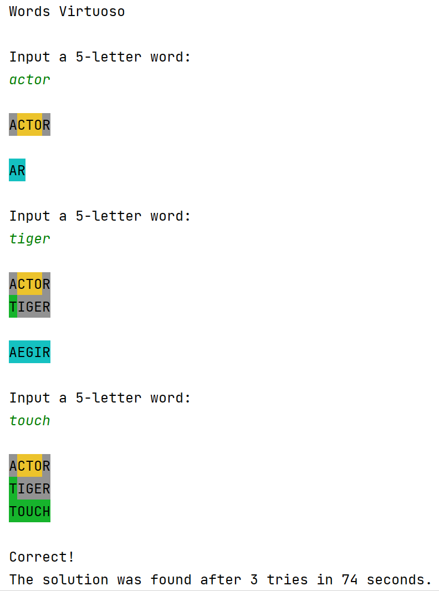

# Stage 6/6: Colors
## Description
In this stage, let's add some colors to the clue strings.

Change the structure of the clue string now, they should be in upper case, with different background color for each letter. These colors are:

- <b style="color: green">Green</b> if the letter in the guess word occurs at the same position as in the secret word.
- <b style="color: yellow">Yellow</b> if the letter occurs but in some other position.
- <b style="grey">Grey</b> in any other case.

For example:

| Secret word | Guess word | Clue string                                       |
|-------------|------------|---------------------------------------------------|
| `spare`     | `steak`    |  |
| `clone`     | `cloth`    |         |
| `snack`     | `daisy`    |        |
| `liner`     | `datum`    |               |

For setting the letter background colors, use the 8-bit ANSI colors (256 coloring scheme). More specifically, the color sequences are:

| Color | Sequence |
|-------|----------|
| Green | `\u001B[48:5:10m<letter>\u001B[0m` |
| Yellow | `\u001B[48:5:11m<letter>\u001B[0m` |
| Grey | `\u001B[48:5:7m<letter>\u001B[0m` |

Where `<letter>` is the letter the background color of which we want to change. The clue word letters should be individually colored.

The wrong letter printouts will have an azure color background — 

For this, use `\u001B[48:5:14m<wrong letters>\u001B[0m` , where `<wrong letters>` is the wrong letters' list. The wrong letters should be <b>group colored</b>.

## Objectives
Implement the coloring scheme as defined in the Description. Each

## Examples
<i>The following examples are images, so the output print color is evident. The user input is the text with in green.</i>

<b>Example 1:</b> <i>normal execution</i>

<b>Example 2:</b> <i>normal execution</i>

<b>Example 3:</b> <i>secret word found on the first try</i>

